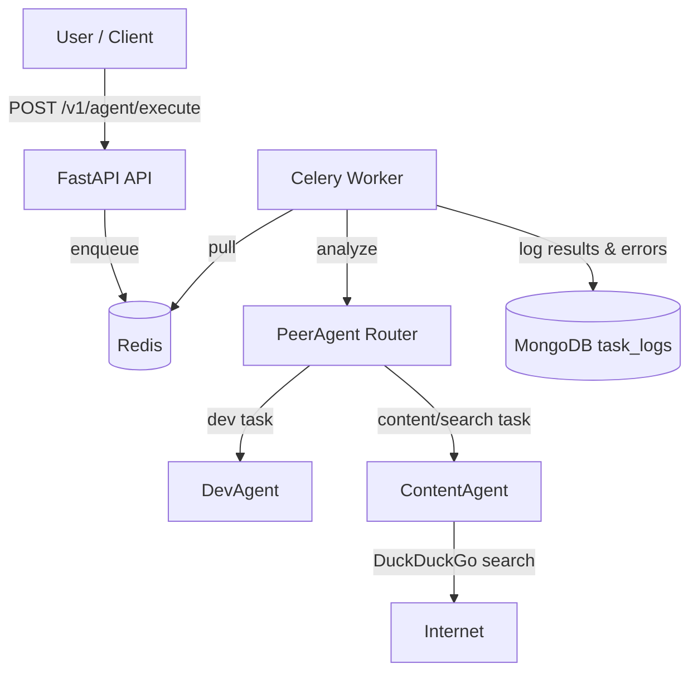

# Reperi AI Backend

Peer-agent controlled task routing with FastAPI, Celery, Redis, MongoDB, and LangChain.

## Architecture



### Components
- **PeerAgent**: Routes tasks to `DevAgent` or `ContentAgent` via simple keyword fallback or LLM (OpenAI GPT-4 when key provided).
- **DevAgent**: Handles coding-style tasks; can perform simple file writes when prompted.
- **ContentAgent**: Performs DuckDuckGo searches (via `langchain_community` tool) and cites sources in answers.
- **FastAPI**: Exposes `POST /v1/agent/execute` and `GET /v1/agent/status/{task_id}`.
- **Celery + Redis**: Queue-backed task execution; workers are stateless and horizontally scalable.
- **MongoDB**: Persists task results (including errors) as Pydantic-validated documents (`task_logs` collection).

## Running Locally
1) Prereqs: Docker + Docker Compose.  
2) Configure environment (`.env` is read by both API and worker):
```
OPENAI_API_KEY=your-openai-api-key  # optional; fallback routing works without it
REDIS_URL=redis://redis:6379/0
MONGODB_URL=mongodb://mongo:27017/
MONGODB_DB_NAME=agent_logs
```
3) Start stack:
```
docker-compose up --build
```
API: http://localhost:8000, Redis: 6379, Mongo: 27017.

### Example Request
```
curl -X POST "http://localhost:8000/v1/agent/execute" \
  -H "Content-Type: application/json" \
  -d '{"task": "Python ile bir dosyayı okuyup yazan kod yaz"}'
```
Check status:
```
curl http://localhost:8000/v1/agent/status/<task_id>
```

## Design Notes
- **Routing**: LLM-based routing when an OpenAI key is present; otherwise deterministic keyword routing to ensure offline functionality.
- **ContentAgent search & citations**: Uses DuckDuckGo search tool, then summarizes with LLM, adding a short sources section.
- **Logging**: Every task result (success or failure) is persisted to MongoDB (`task_logs`). Logging failures are non-fatal but printed to stdout.
- **Error handling**: Empty tasks rejected (400/422). Queueing failures return 500. Status endpoint uses Celery backend to report real state/result.
- **Model selection**: Defaults to `gpt-4o-mini` for routing and workers (cheapest), configurable via `OPENAI_MODEL_ROUTER` and `OPENAI_MODEL_WORKER` env vars.
- **Extensibility**: Add agents by implementing `BaseWorker.execute` and extending `PeerAgent` prompt/routing keywords.
- **API concerns**: Versioned under `/v1`. Rate limiting can be added via Redis-backed limiters (e.g., `redis-cell`). Consider auth (API keys/JWT) for production.

## DevOps
- `Dockerfile` + `docker-compose.yml` run API, worker, Redis, Mongo.
- GitHub Actions: `ci.yml` runs pytest.
- CodeDeploy hooks: `appspec.yml` + `scripts/` (before install, start, stop) are available if you deploy via CodeDeploy.

## Tests
- `pytest tests/` exercises routing fallback and API happy-path/validation.
- To extend coverage: add integration tests spinning up Redis/Celery, plus error-path tests (unknown agent, model failures), and contract tests for Mongo persistence.

## AI & Prompting
- LLM: OpenAI GPT-4 for routing, GPT-3.5-turbo for workers (configurable in code).
- Prompts are concise and task-focused; ContentAgent prompt explicitly requests cited sources when search results are available.

## Production Hardening Ideas
- Add structured logging (JSON) and observability (OpenTelemetry).
- Input validation & security: task length limits, auth, PII redaction.
- Robust retries/backoff for Mongo/Redis, dead-letter queue for failed tasks.
- API rate limiting + request ID propagation for tracing.
