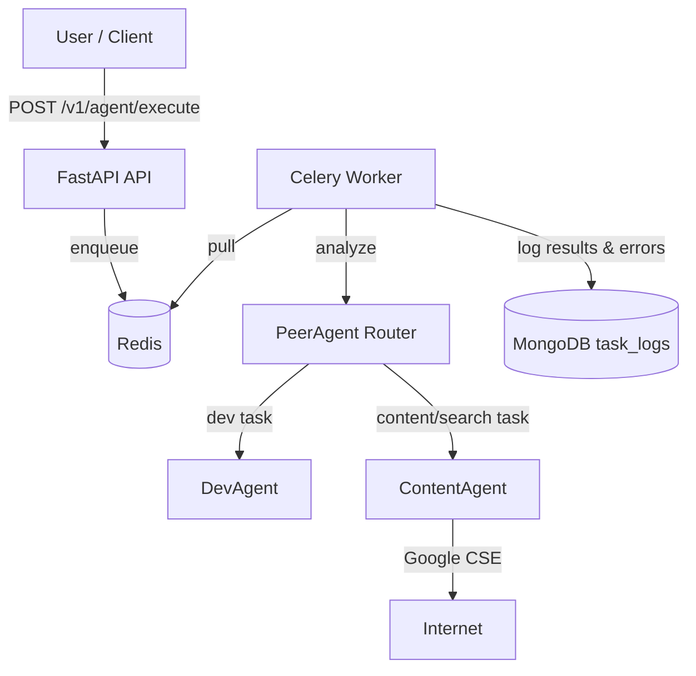

# Reperi AI Backend

Peer-agent controlled task routing with FastAPI, Celery, Redis, MongoDB, and LangChain.

## Architecture



### Components
- **PeerAgent**: Routes tasks to `DevAgent` or `ContentAgent` via simple keyword fallback or LLM (OpenAI, defaults to `OPENAI_MODEL_ROUTER`).
- **DevAgent**: Handles coding-style tasks; can perform simple file writes when prompted.
- **ContentAgent**: Uses Google Custom Search HTTP API (when `GOOGLE_API_KEY` + `GOOGLE_CSE_ID` are set) to pull snippets and have the LLM answer with citations; without those keys it falls back to plain LLM answers (no citations).
- **FastAPI**: Exposes `POST /v1/agent/execute` and `GET /v1/agent/status/{task_id}` and `POST /v1/agent/execute/sync`.
- **Celery + Redis**: Queue-backed task execution; workers are stateless and horizontally scalable.
- **MongoDB**: Persists task results (including errors) as Pydantic-validated documents (`task_logs` collection).

## Running Locally
1) Prereqs: Docker + Docker Compose.  
2) Configure environment (`.env-example` is read by both API and worker): you should create your own `.env` file based on it. Minimal required vars:
```
OPENAI_API_KEY=your-openai-api-key  # optional; fallback routing works without it
REDIS_URL=redis://redis:6379/0
MONGODB_URL=mongodb://mongo:27017/
MONGODB_DB_NAME=agent_logs
GOOGLE_API_KEY=your-google-api-key  # needed for ContentAgent web search
GOOGLE_CSE_ID=your-google-cse-id    # needed for ContentAgent web search
```
3) Start stack:
```
docker-compose up --build
```
API: http://localhost:8000, Redis: 6379, Mongo: 27017.

### Example Request
```
curl -X POST "http://localhost:8000/v1/agent/execute" \
  -H "Content-Type: application/json" \
  -d '{"task": "Python ile bir dosyayı okuyup yazan kod yaz"}'
```
Check status:
```
curl http://localhost:8000/v1/agent/status/<task_id>
```

## Design Notes
- **Routing**: LLM-based routing when an OpenAI key is present; otherwise deterministic keyword routing to ensure offline functionality.
- **ContentAgent search & citations**: Uses Google Custom Search via REST to fetch snippets; answers cite only returned links. Without Google keys it skips search and answers directly.
- **Logging**: Every task result (success or failure) is persisted to MongoDB (`task_logs`). Logging failures are non-fatal but printed to stdout.
- **Error handling**: Empty tasks rejected (400/422). Queueing failures return 500. Status endpoint uses Celery backend to report real state/result.
- **Model selection**: Defaults to `gpt-4o-mini` for both router and workers (configurable via `OPENAI_MODEL_ROUTER` / `OPENAI_MODEL_WORKER`).
- **Extensibility**: Add agents by implementing `BaseAgent.execute` and extending `PeerAgent` prompt/routing keywords.
- **API concerns**: Versioned under `/v1`. Rate limiting can be added via Redis-backed limiters (e.g., `redis-cell`). Consider auth (API keys/JWT) for production.
- **AI tools**: Uses OpenAI (via `langchain-openai`) for routing and worker LLM calls; swap models via env vars to align cost/quality.

### LangGraph vs. current LangChain usage
- Today: Simple chains and Celery-backed async execution are enough for single-step routing/agent calls.
- When to add LangGraph? If we need conditional branching, verifier/fix steps, automatic retry/looping, multi-agent orchestration, or richer state management, moving to a graph-based flow makes sense.
- Roadmap: When that complexity shows up, model the router + agent flow as a LangGraph, then layer in branching/iterative steps. Until then, we keep the setup lean.

## DevOps
- `Dockerfile` + `docker-compose.yml` run API, worker, Redis, Mongo.
- GitHub Actions: `ci.yml` runs pytest.
- CodeDeploy hooks: `appspec.yml` + `scripts/` (before install, start, stop) are available if you deploy via CodeDeploy.

## Tests
- `pytest tests/` exercises API validation, router keyword fallback, and Celery eager path (in-memory broker/backend).
- `tests/test_api.py` targets a live `/v1/agent/execute/sync` endpoint and is meant for local/manual runs, not CI.
- To extend coverage: add search happy-path with Google CSE keys, file-write paths for DevAgent, and Mongo persistence/queue failure cases.

## AI & Prompting

### LLM Selection
- **Models**: OpenAI `gpt-4o-mini` (default) - optimized for cost/performance balance
- **Router Model**: Configurable via `OPENAI_MODEL_ROUTER`
- **Worker Model**: Configurable via `OPENAI_MODEL_WORKER`

### Prompt Design

| Agent | Strategy | Key Decisions |
|-------|----------|---------------|
| **PeerAgent** | Single-word output constraint ("dev" or "content") | Minimizes parsing errors, enables keyword fallback |
| **ContentAgent** | Grounding with web sources + citation format `[1], [2]` | Reduces hallucination, enables verifiability |
| **DevAgent** | Role prompting ("experienced developer") + Python default | Consistent quality, handles ambiguous requests |

### Techniques Used
- **Role prompting**: Persona assignment for consistent output style
- **Grounding**: Web search results injected to reduce hallucination
- **Explicit constraints**: Single-word responses for reliable parsing
- **Graceful fallback**: Keyword-based routing when LLM unavailable

### Future Improvements
- Few-shot examples for edge cases
- Prompt versioning for A/B testing
- Chain-of-thought for complex tasks

## Production Hardening Ideas
- Input validation & security: task length limits, auth, PII redaction.
- Robust retries/backoff for Mongo/Redis, dead-letter queue for failed tasks.
- API rate limiting + request ID propagation for tracing.
- **Session / Conversation Memory**: Currently each request is stateless. For multi-turn conversations:
  - Accept `session_id` in request payload
  - Store conversation history in Redis or MongoDB keyed by session
  - Use LangChain's `ConversationBufferMemory` or `RedisChatMessageHistory` to maintain context
  - Pass message history to LLM calls so agents can reference previous turns
  - Consider TTL for sessions to manage memory/storage


## Live Demo

The system is currently running locally and exposed via ngrok tunnel:

**API Documentation (Swagger UI):** https://oversilent-cecile-latterly.ngrok-free.dev/docs

> ⚠️ **Note:** This is not deployed to a production server. The application runs on a local machine and is temporarily exposed to the internet using [ngrok](https://ngrok.com/). Availability depends on the local machine being online and the ngrok session being active.
